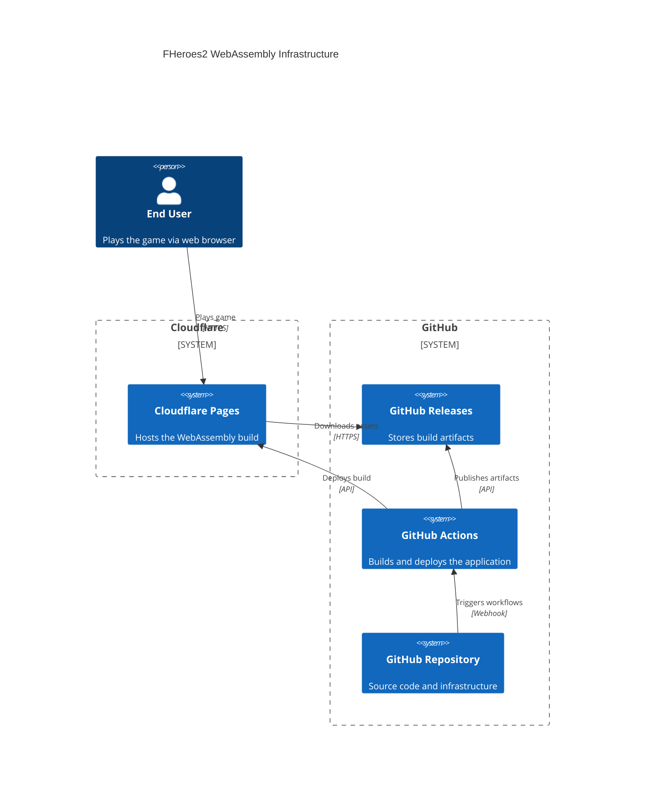

# FHeroes2 WebAssembly Deployment Process

This document describes the end-to-end deployment strategy for the FHeroes2 WebAssembly build, targeting Cloudflare Pages for hosting and leveraging GitHub Actions and
Terraform for automation.

## Goals

* Allow end users to click a link and launch the game locally or via the web.
* Automatically deploy the WebAssembly build to Cloudflare Pages on version tag.
* Avoid unnecessary redeployments for the same version.
* Ensure the right HTTP headers are configured for the WASM build.

## Infrastructure Diagram



## Deployment Pipeline Overview

### Trigger

* Deployment is triggered **only when a new Git tag is pushed** (e.g. `v1.2.3`).
* A GitHub Action workflow listens via `workflow_run` to wait for the build-and-release process.

### Build Process (Upstream)

* Compiles the FHeroes2 WebAssembly bundle using Emscripten.
* Packages assets and build artifacts into a ZIP file.
* Publishes the ZIP as a GitHub Release asset using `ncipollo/release-action`.

### Deploy Process (Downstream)

* Listens for completion of the upstream `Make` workflow.
* Pulls the latest GitHub Release and extracts the ZIP bundle.
* Deploys the bundle to Cloudflare Pages.

## Infrastructure Management

Terraform is used to:

* Provision and configure the Cloudflare Pages project.
* Define custom HTTP headers required for the WebAssembly to function properly (e.g. `Cross-Origin-Embedder-Policy`, `Cross-Origin-Opener-Policy`).

The Terraform workflow (`terraform.yml`) automatically runs when:

* Changes are made to any `.tf` files in the repository
* Changes are made to GitHub Actions workflow files (`.github/workflows/*.yml`)

## File/Artifact Structure

```tree
<filesystem>/
  ├── index.html
  ├── fheroes2.jpeg
  ├── fheroes2.js
  ├── fheroes2.wasm
```

## GitHub Workflows Summary

### make.yml

* Triggered on `push` to branch
* Builds the application
* Publishes release assets if tagged

### deploy.yml

* Triggered on `workflow_run` completion of `make.yml`
* Deploys to Cloudflare Pages

## Future Considerations

* Hook up a custom domain if needed
* Add redirect from GitHub Pages to Cloudflare Pages
* Allow QA deployments from non-tagged branches (e.g. `develop`, `main-preview`)
* Explore storing deployed tag in Cloudflare KV instead of a file
